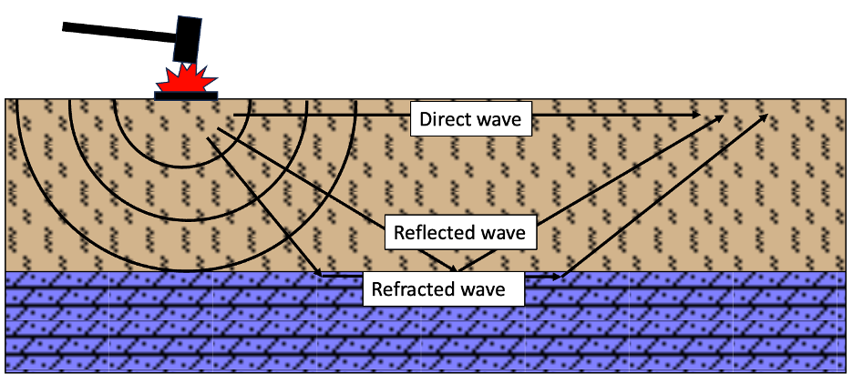
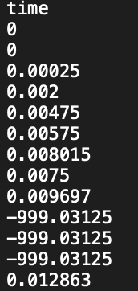
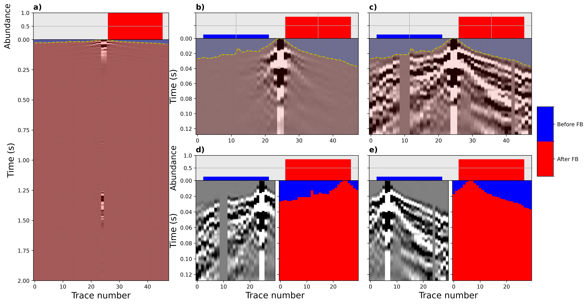
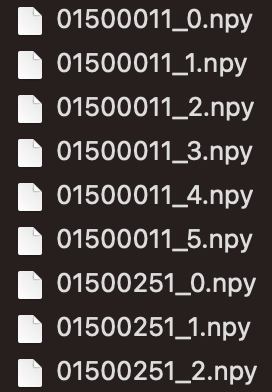
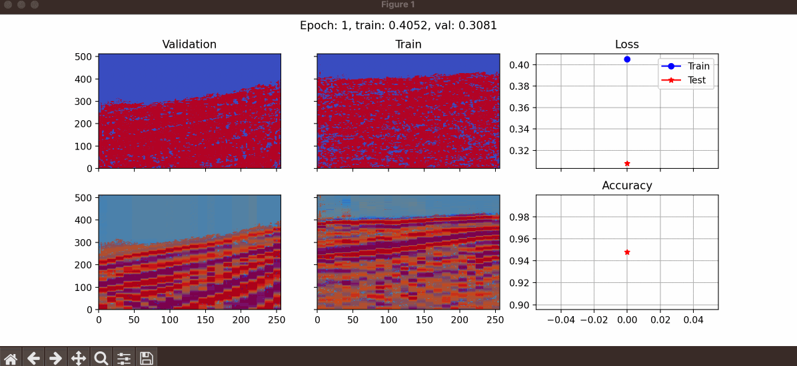
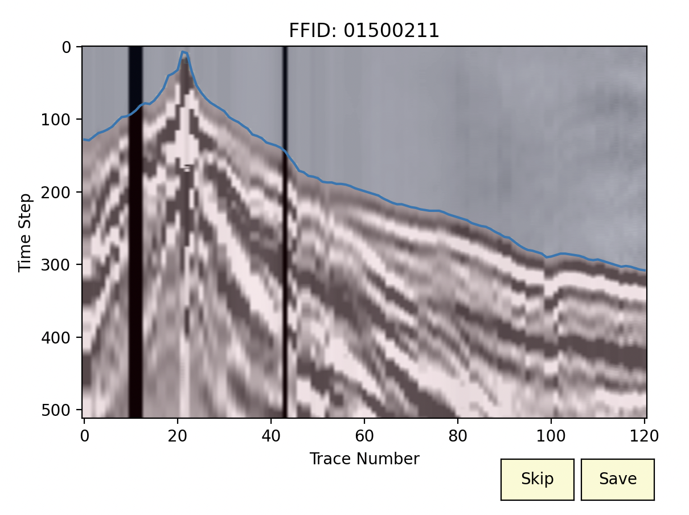

<a id="top"></a>
# First-Break Picking Using Deep Learning

This repository is used to implement first-break (FB) picking task using deep learning. 
For this purpose, we used a U-net to segment the data as before and after first arrivals.

- [First-Break Picking Using Deep Learning](#first-break-picking-using-deep-learning)
  - [1. Installation](#1-installation)
  - [2. First-Break Picking](#2-first-break-picking)
    - [2.1 Initial data files](#21-initial-data-files)
    - [2.2 Data preprocessing](#22-data-preprocessing)
    - [2.3 Training for FB picking](#23-training-for-fb-picking)
    - [2.4 Predicting the first break of one seismic shot](#24-predicting-the-first-break-of-one-seismic-shot)

In a seismic shot record, the first arrival is usually the direct wave from the source followed by refractions (Figure 1). The travel time of a seismic wave from a source to a geophone is called first break. First breaks are invaluable source of information in near surface studies. We can employ first breaks to obtain a velocity model of the near surface. In addition to the importance of first breaks for refraction inversion and understanding the characteristics of the near surface, they can be employed to perform a successful reflection seismic processing and multi-channel analysis of surface waves (MASW).


  
## 1. Installation
To install this package, you need to first clone the code
```console
pip install git+https://github.com/geo-stack/first_break_picking.git
```

## 2. First-Break Picking
We solve the first-break picking as a segmentation problem. It means, we have two segments, 
1. before FB,
2. after FB.
   
In this way, FB can be picked as the interface between two segments.


In the next sections, we see how to prepare the dataset and the processing steps that can be done to improve the accuracy of the results.

### 2.1 Initial data files
To use this package, user needs to prepare the dataset apropriately.
In one folder, we need to have the seismic data and corresponding FB (for training) in `.npy` and `.txt` format.
An example of the first-break file can be seen in the following figure.




### 2.2 Data preprocessing
After preparing the initial data files in `.npy` and `.txt` formats, we can perform some preprocessing steps using `save_shots_fb`. To explain the arguments of this function, let's look at the following figure.

<a id="Figure2"></a>


- We have a great data imbalance which leads to decrease of the accuracy. To deal with this problem, we crop the data (a) to generate data presented in (b). For this purpose, `save_shots_fb` gets an argument called `time_window` which gets a list with two integer value showing the beginning and the end of cropping window (in terms of sample and NOT time). Basically, the first element of this list should be `0`. For example, I use `time_window = [0, 512]`. 
- In the next step, we scale the data to increase the accuracy and ease of the learning. This step leads to the image (c). To do so, user can use two arguments, `scale` and `grayscale`, which are boolean and should be set on `True`.
- For data augmentation, we divide each seismic shot to some subimages with an specific overlap (e and d). For this purpose, `save_shots_fb` get `split_nt` to specify number of columns in each subimage and `overlap` which defines the overlap of subimages in terms of percentage, between `0.0` to `1.0`. I usually use `overlap = 0.15`. For shots with 48 traces, I use `split_nt = 22`, but in case of shots with more traces, we can use larger value for `split_nt`.
- It is really important to provide `save_shots_fb` with correct value for the sampling rate  as `dt`.
- This function also gets two other arguments to specify the extension of shot and first-break files as `shot_ext` and `fb_ext`. This can be used to develop the code easily in case we want to load `.segy` or `.json` files.
- `save_shots_fb` saves the processed data at `dir_to_save`. 


So, here it is how to call this function,

```Python
from first_break_picking.data import save_shots_fb

data_info = save_shots_fb(
        dataset_dir=path_to_load,
        dir_to_save=path_save,
        split_nt= split_nt,
        overlap = overlap,
        time_window=[0, n_time_sampels],
        fbt_file_header=fbt_file_header,
        fbt_time_column=0,
        scale=True,
        grayscale=True,
        dt=dt_project,
        shot_ext=".npy",
        fb_ext=".txt" if phase=="train" else None
    )

data_info.to_csv(f"{path_save}_data_info.txt", index=False)
```
The function `save_shots_fb` returns a Pandas DataFrame which should be saved for using during the prediction.
Here is an example of saved data for a project.



<div class="alert alert-block alert-warning">
<b>Warning:</b> Please be careful for choosing appropriate sampling rate.
</div>

### 2.3 Training for FB picking
To train a network, we use the function `train`. This function gets some arguments which are presented here.
- `train_data_path`: Path of training dataset (can be a list of different datasets).
- `upsampled_size_row`: We upsample the data samples before sending them into the model. This variable is used to define the number of row in upsampled size (must be dividable by 16).
- `upsampled_size_col`: This variable is used to define the number of columns in upsampled size (must be dividable by 16).
- `batch_size`: Number of data samples that are taken into account togeher to caluclate the loss.
- `val_percentage`: Value between 0 to 1 to specify the percentage of data that is used to test the generalizability of the algorithm.
- `epochs`: Number of iteration.
- `learning_rate`: This is used to define the learning rate.
- `path_to_save`: Path to a folder to save the checkpoints and loss values.
- `checkpoint_path`: In case user wants to start training a pretrained network, the path of the checkpoint should be specified here.
- `step_size_milestone`: Is used to define a learning rate scheduler. If you want to halve the learning rate at an specific number of epochs, this argument should be used.
- `show`: This is a boolean and can be used to specify if user likes to see the learning procedure. If set to `True`, a figure would be presented like the following example.


Here is an example of calling this function,
```Python
from first_break_picking import train
from first_break_picking.tools import seed_everything

seed_everything(10)

train_data_path = [
    "path/to/train/dataset_0",
    "path/to/train/dataset_n",
]

train(train_data_path, 
      upsampled_size_row=n_time_sampels,
      upsampled_size_col=upsampled_size_col,
      batch_size=batch_size, 
      val_percentage=val_percentage,
      epochs=num_epcohs, 
      learning_rate=1e-4, 
      device="mps",
      path_to_save="path/to/save/results/checkpoints",
      save_frequency=num_epcohs,
      loss_fn_name=loss_fn,
      model_name=model_name,
      checkpoint_path=None,
      features=[16, 32, 64, 128],
      in_channels=1,
      out_channels=2,
      encoder_weight="imagenet",
      step_size_milestone=15,
      show=True
      )
```

### 2.4 Predicting the first break of one seismic shot
If you want to predict the first breaks in numerous shots, you should create the dataset as described [here](#22-data-preprocessing). 
However, if you need to predict the first break on only one shot (or all shots in a loop without saving dataset), the class `Predictor` should be used.
This object can be created as, 
```Python
from first_break_picking import Predictor

predictor = Predictor(
        path_to_save="path/to/save/results/checkpoints",
        checkpoint_path=checkpoint,
        split_nt=split_nt, 
        overlap=overlap, 
        upsampled_size_row=n_time_sampels, 
        upsampled_size_col=upsampled_size_col,
        dt = dt,
        smoothing_threshold=smoothing_threshold,
        model_name="unet_resnet"
)
```
- `path_to_save`: Path to a folder to save the result (will be overwritten).
- `checkpoint_path`: Path of the checkpoint that is saved after training.
- `split_nt` Number of columns in each subimage.
- `overlap`: Overlap of subimages of one shot.
- `upsampled_size_row`: Number of rows in upsampled image.
- `upsampled_size_col`: Number of columns in upsampled image.
- `dt`: Temporal samping rate.
- `smoothing_threshold`: An integer used to avoid the generated artifacts above the the true FB.
  
By creating this object, we can now give the path of one seismic shot (as presented in [Figure 2a](#Figure2)) to the method `predict` and get the first break.

```Python
predictor.predict(
        path_data=path_data
)
```


<div class="alert alert-block alert-warning">
<b>Warning:</b> If you define the sampling rate incorrrectly, you can't see its effects on the plot (Y-axis is time step), but the saved time in first-break folder will be wrong.
</div>
<br>

<!-- ## Issues and Questions -->
**Ackowledgment:**<br>
This work, developped by [Amir Mardan](https://github.com/AmirMardan), was supported by Mitacs through the Mitacs Elevate Program.


[Top](#top)

